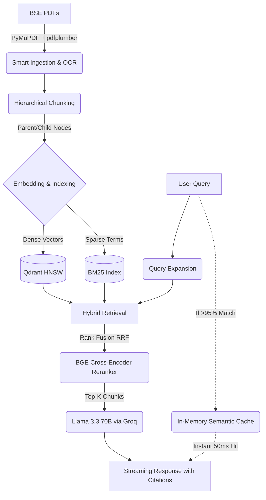

<div align="center">
  
# FinRAG — Production Financial AI Assistant


> **An enterprise-grade Retrieval-Augmented Generation (RAG) system built over the official BSE Annual Reports of 17 major Indian companies.**
> FinRAG leverages advanced hybrid retrieval, cross-encoder reranking, and semantic caching to deliver lightning-fast, 100% grounded financial insights.

---
</div>

## 📑 Table of Contents
- [Project Overview](#-project-overview)
- [Core Features & UI](#-core-features--ui)
- [Production RAG Architecture](#-production-rag-architecture)
- [Tech Stack](#-tech-stack)
- [Companies Covered](#-companies-covered)
- [Local Setup & Running](#-local-setup--running)

---

## 🎯 Project Overview

FinRAG solves the hallucination problem in financial AI. It processes massive, complex PDF annual reports and transforms them into an interactive, highly-accurate AI assistant. Whether you need deep-dive qualitative analysis or exact quantitative metrics, every single claim the AI makes is backed by a direct, clickable citation linking directly to the source page of the official financial report.

---

## 🚀 Core Features & UI

### Main Interface


### Interactive Chat (Grounded Q&A)
Ask natural language questions about any company's financial performance. Features a **Semantic Cache** for blazing-fast 50ms responses on repeated/similar queries, and clickable source badges that instantly open the exact PDF page where the AI found the data.


#### 💡 Natural Language Explanations


### Automated KPI Dashboard
Automatically extracts and displays key financial metrics (Revenue, Net Profit, EPS, ROE, NPA) into a beautiful, color-coded dashboard. Includes dynamically split Plotly charts (P&L vs Balance Sheet) that accurately represent data magnitude.


### Cross-Document Compare Mode
A powerhouse analytical workspace capable of running parallel retrievals across different documents. You can instantly compare multiple companies (e.g., "HDFC vs ICICI Gross NPA") or track Year-over-Year trends for a single company (e.g., "TCS FY24 vs FY25 Revenue").


---

## 🧠 Production RAG Architecture

FinRAG implements state-of-the-art information retrieval techniques to ensure enterprise-grade accuracy.



### Advanced Concepts Used:
- **Hierarchical Chunking:** Splits documents into small chunks for precise searching, but passes the larger surrounding "parent" context to the LLM to prevent data fragmentation.
- **Hybrid Search (Dense + Sparse):** Combines Semantic vector search (Qdrant) with exact keyword matching (BM25) and fuses the scores using **Reciprocal Rank Fusion (RRF)**.
- **Cross-Encoder Reranking:** The initial search pulls 30-50 candidates. A powerful `BAAI/bge-reranker-base` model then heavily scores and re-orders them to find the absolute top 3-5 most relevant chunks.
- **Semantic Caching:** A NumPy-powered in-memory vector cache that short-circuits the entire pipeline if a user asks a semantically similar question, saving expensive API tokens.

---

## 🛠️ Tech Stack

- **Backend / API:** Python 3.12, FastAPI, Uvicorn
- **Frontend UI:** Vanilla JS, HTML, CSS (Custom Glassmorphism UI)
- **Vector Database:** Qdrant (Local via Docker)
- **Embeddings:** `BAAI/bge-large-en-v1.5`
- **Reranker:** `BAAI/bge-reranker-base`
- **LLM Inference:** Llama 3.3 70B (Powered by Groq LPUs for ultra-low latency)

---

## 🏢 Companies Covered

Data includes **FY2024–FY2025** BSE Annual Reports for 17 major entities across IT, Banking, FMCG, and Infrastructure:

*Airtel, Axis Bank, Bajaj Finance, HCL, HDFC Bank, HUL, ICICI Bank, Infosys, ITC, Kotak Mahindra Bank, Karur Vysya Bank, L&T, Maruti Suzuki, MRF, ONGC, Reliance Industries, SBI, TCS.*

---

## ⚙️ Local Setup & Running

1. **Clone & Install Dependencies**
```bash
git clone https://github.com/yourusername/finrag.git
cd finrag
pip install -r requirements.txt
```

2. **Set Environment Variables**
Create a `.env` file in the root directory:
```env
GROQ_API_KEY=gsk_your_groq_api_key_here
```

3. **Start the Qdrant Database (Docker required)**
```bash
docker run -p 6333:6333 -p 6334:6334 -v $(pwd)/qdrant_storage:/qdrant/storage:z qdrant/qdrant
```

4. **Run the FastAPI Server**
```bash
python -X utf8 -m uvicorn app.api.server:app --port 8000 --reload
```

5. **Open the UI**
Navigate to `http://localhost:8000/` in your browser.
